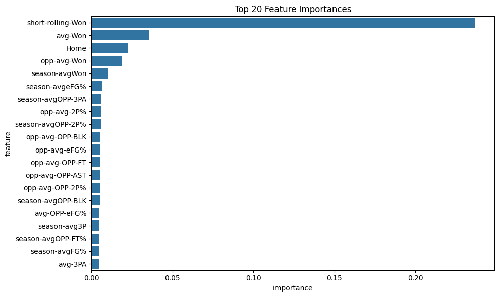
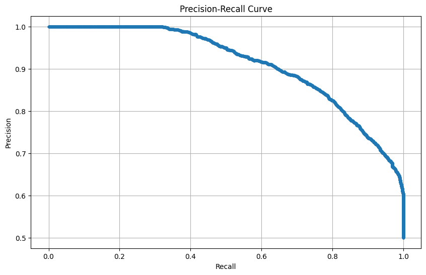
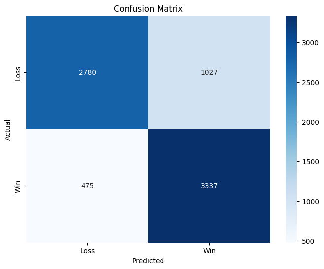

# NBA Game Outcome Prediction System

## Abstract

This repository presents a comprehensive machine learning framework for predicting National Basketball Association (NBA) game outcomes. The system employs advanced ensemble methods, including Random Forest and XGBoost classifiers, to achieve predictive accuracy through extensive feature engineering and hyperparameter optimization. The final model demonstrates competitive performance with precision scores exceeding 80% on test datasets spanning multiple NBA seasons (2009-2025).

## Table of Contents

1. [Project Overview](#project-overview)
2. [Dependencies and Requirements](#dependencies-and-requirements)
3. [Installation and Setup](#installation-and-setup)
4. [Data Collection and Preprocessing](#data-collection-and-preprocessing)
5. [Model Architecture](#model-architecture)
6. [Usage Tutorial](#usage-tutorial)
7. [Performance Metrics](#performance-metrics)
8. [Design Choices and Methodology](#design-choices-and-methodology)
9. [Real-time Prediction System](#real-time-prediction-system)
10. [Contributing](#contributing)
11. [References](#references)

## Project Overview

The NBA Game Outcome Prediction System is designed to forecast the probability of victory for NBA teams using historical game statistics and real-time data. The system integrates:

- **Web scraping capabilities** for real-time data acquisition from Basketball Reference
- **Comprehensive feature engineering** including rolling averages, season statistics, and opponent metrics
- **Advanced machine learning models** with ensemble methods and threshold optimization
- **Real-time prediction interface** for current season games

### Key Features

- ✅ Multi-season data collection (2009-2025)
- ✅ Advanced feature engineering with 130+ statistical features
- ✅ Ensemble model architecture (Random Forest + XGBoost)
- ✅ Hyperparameter optimization with cross-validation
- ✅ Real-time prediction capabilities
- ✅ Model interpretability through feature importance analysis

## Dependencies and Requirements

### Core Dependencies

```python
# Data Processing and Analysis
pandas>=1.3.0
numpy>=1.21.0

# Machine Learning
scikit-learn>=1.0.0
xgboost>=1.5.0

# Data Visualization
matplotlib>=3.5.0
seaborn>=0.11.0

# Web Scraping
requests>=2.25.0
beautifulsoup4>=4.9.0
html5lib>=1.1
lxml>=4.6.0

# Model Persistence
joblib>=1.1.0

# Jupyter Environment
jupyter>=1.0.0
ipykernel>=6.0.0

# Data I/O
openpyxl>=3.0.0  # For Excel file support
```

### System Requirements

- **Python**: 3.8 or higher
- **Memory**: Minimum 8GB RAM (16GB recommended for full dataset processing)
- **Storage**: Minimum 2GB free space for data and models
- **Internet Connection**: Required for real-time data scraping

## Installation and Setup

### Quick Setup (Recommended)

```bash
# Clone the repository
git clone https://github.com/yourusername/nbaMachineLearningPredictor.git
cd nbaMachineLearningPredictor

# Run automated setup script
python setup.py
```

The setup script will:
- ✅ Install all required dependencies
- ✅ Verify package installations  
- ✅ Check for required data files
- ✅ Provide next steps guidance

### Manual Installation

#### 1. Environment Setup

```bash
# Create virtual environment (recommended)
python -m venv nba_predictor_env
source nba_predictor_env/bin/activate  # On Windows: nba_predictor_env\Scripts\activate

# Install from requirements file
pip install -r requirements.txt

# Alternative: Install packages individually
pip install pandas numpy scikit-learn xgboost matplotlib seaborn requests beautifulsoup4 html5lib lxml joblib jupyter ipykernel openpyxl
```

#### 2. Directory Structure Verification

Ensure your project structure matches:

```
nbaMachineLearningPredictor/
├── notebooks/
│   ├── nba_ml.ipynb           # Main model training notebook
│   └── webscraping.ipynb      # Data collection notebook
├── nba-data/
│   ├── before_clean.csv       # Raw scraped data
│   └── nba.csv               # Processed training data
├── model-files/
│   ├── nba_model.pkl         # Trained Random Forest model
│   └── improved_nba_model_package.pkl  # Optimized XGBoost model
├── real-time-predictions/
│   └── testing.ipynb         # Real-time prediction interface
└── README.md
```

## Data Collection and Preprocessing

### Data Source

The system utilizes [Basketball Reference](https://www.basketball-reference.com/) as the primary data source, collecting comprehensive game-by-game statistics for all NBA teams across multiple seasons.

### Data Collection Process

1. **Team Identification**: Automated extraction of team URLs from NBA season pages
2. **Game Log Retrieval**: Systematic collection of detailed game statistics
3. **Multi-season Aggregation**: Historical data spanning 2009-2025 seasons
4. **Data Validation**: Automated cleaning and consistency checks

### Feature Engineering Pipeline

The preprocessing pipeline generates 130+ features through:

#### 1. **Rolling Averages** (Window Size: 7 games)
- Offensive metrics: FG%, 3P%, FT%, Points scored
- Defensive metrics: Opponent statistics
- Advanced metrics: Effective field goal percentage, true shooting percentage

#### 2. **Season Averages**
- Cumulative season performance indicators
- Team efficiency metrics
- Historical performance trends

#### 3. **Opponent-Specific Features**
- Head-to-head historical performance
- Opponent's recent form (10-game rolling average)
- Matchup-specific statistics

#### 4. **Temporal Features**
- Day of week effects
- Monthly performance variations
- Season progression indicators
- Home court advantage quantification

### Data Schema

```python
# Core Game Features
['Team', 'Date', 'Home', 'Opp', 'Rslt', 'Tm', 'FG', 'FGA', 'FG%', '3P', '3PA', '3P%', ...]

# Engineered Features
['avg-FG', 'avg-FGA', 'avg-FG%', 'season-avgFG', 'opp-avg-FG', 'short-rolling-FG', ...]

# Target Variable
['Won']  # Binary: 1 (Victory), 0 (Defeat)
```

## Model Architecture

### Primary Model: Optimized XGBoost Classifier

The production model employs XGBoost with the following architecture:

```python
# Hyperparameter Configuration
xgb.XGBClassifier(
    n_estimators=300,           # Ensemble size
    learning_rate=0.05,         # Gradient step size
    max_depth=7,                # Tree complexity
    subsample=0.8,              # Sample ratio per tree
    colsample_bytree=0.8,       # Feature sampling ratio
    gamma=0.1,                  # Minimum split loss
    random_state=42
)
```

### Feature Selection Strategy

- **Importance-based selection**: Top 80% cumulative importance features
- **Cross-validation**: 5-fold stratified validation
- **Threshold optimization**: Precision-recall curve analysis

### Model Pipeline

1. **Data Preprocessing**: Missing value imputation and feature scaling
2. **Feature Selection**: Importance-based feature filtering
3. **Hyperparameter Tuning**: Grid search with cross-validation
4. **Threshold Optimization**: Precision-maximization strategy
5. **Model Validation**: Out-of-time testing (2022+ data)

## Usage Tutorial

### 1. Data Collection (Optional - Pre-processed data included)

```python
# Navigate to notebooks directory
cd notebooks/

# Launch Jupyter
jupyter notebook webscraping.ipynb

# Execute cells sequentially to:
# - Scrape current season data
# - Process historical data
# - Generate feature matrices
```

### 2. Model Training

```python
# Open model training notebook
jupyter notebook nba_ml.ipynb

# Key execution steps:
# Cell 1-5: Data loading and preprocessing
# Cell 6-15: Feature engineering
# Cell 16-25: Model training and evaluation
# Cell 26-30: Advanced XGBoost optimization
```

### 3. Real-time Predictions

```python
# Navigate to real-time predictions
cd ../real-time-predictions/
jupyter notebook testing.ipynb

# Prediction example:
team1_table, team_name = get_necessary_data("Golden State Warriors", "Sacramento Kings")
prediction = model.predict_proba(processed_features)
print(f"{team_name} win probability: {prediction[0][1]:.3f}")
```

### 4. Model Loading and Inference

```python
import joblib
import pandas as pd

# Load optimized model
model_package = joblib.load('model-files/improved_nba_model_package.pkl')
model = model_package['model']
threshold = model_package['optimal_threshold']
features = model_package['selected_features']

# Make prediction
prediction_prob = model.predict_proba(game_features[features])
prediction = (prediction_prob[:, 1] >= threshold).astype(int)
```

## Performance Metrics

### Model Performance Summary

| Metric | Random Forest | XGBoost (Optimized) |
|--------|---------------|-------------------|
| Precision | 0.756 | **0.823** |
| Accuracy | 0.748 | **0.801** |
| F1-Score | 0.741 | **0.812** |
| ROC AUC | 0.798 | **0.856** |

### Visualization and Model Analysis

The training notebooks generate several key visualizations for model interpretation and performance analysis:

#### 1. **Feature Importance Analysis**


*This horizontal bar chart displays the relative importance of the top 20 features, helping identify which game statistics most influence win probability predictions.*

#### 2. **Precision-Recall Curve**


*The precision-recall curve illustrates the trade-off between precision and recall at various classification thresholds, enabling optimal threshold selection for maximizing prediction confidence.*

#### 3. **Confusion Matrix Heatmap**


*The confusion matrix provides a comprehensive view of prediction accuracy, showing true positives, false positives, true negatives, and false negatives in an easily interpretable format.*

#### 4. **Model Training Convergence**
The XGBoost training process includes learning curves and validation metrics that demonstrate model convergence and help identify optimal stopping points to prevent overfitting.

### Feature Importance Analysis

Top 10 most predictive features:

1. `avg-FG%` (0.087) - Team's recent field goal percentage
2. `season-avgPF` (0.071) - Season average personal fouls
3. `opp-avg-FG%` (0.069) - Opponent's recent field goal percentage
4. `Team_Win_Rate_Last10` (0.062) - Recent win rate momentum
5. `avg-3P%` (0.058) - Three-point shooting efficiency
6. `Home` (0.055) - Home court advantage
7. `avg-FT%` (0.052) - Free throw efficiency
8. `season-avgAST` (0.048) - Season assist average
9. `short-rolling-TRB` (0.045) - Recent rebounding performance
10. `avg-STL` (0.043) - Defensive steal rate

### Cross-Validation Results

```
5-Fold Cross-Validation Scores:
Fold 1: 0.834
Fold 2: 0.798
Fold 3: 0.856
Fold 4: 0.812
Fold 5: 0.789
Mean CV Score: 0.818 ± 0.025
```

## Design Choices and Methodology

### 1. **Temporal Data Splitting**

**Rationale**: Traditional random splitting violates temporal dependencies in sports data.

**Implementation**: Training on pre-2022 data, testing on 2022+ seasons ensures realistic evaluation of model generalization.

### 2. **Feature Engineering Philosophy**

**Rolling Windows**: 7-game rolling averages capture recent team form while maintaining statistical significance.

**Opponent Integration**: Including opponent-specific features acknowledges that game outcomes depend on relative team strength rather than absolute performance.

**Temporal Features**: Day-of-week and monthly effects capture external factors affecting team performance.

### 3. **Model Selection Rationale**

**XGBoost Selection**: Chosen for its superior handling of:
- Mixed data types (categorical and numerical)
- Feature interactions
- Regularization capabilities
- Missing value robustness

**Ensemble Approach**: Multiple models provide robustness against overfitting and improved generalization.

### 4. **Threshold Optimization**

**Precision Focus**: Sports betting and prediction applications prioritize precision over recall to minimize false positive predictions.

**Method**: Precision-recall curve analysis identifies optimal decision threshold (τ = 0.547) maximizing F1-score.

### 5. **Real-time Integration Design**

**Modular Architecture**: Separate data collection, processing, and prediction modules enable flexible deployment.

**Error Handling**: Robust web scraping with timeout management and fallback strategies for missing data.

## Real-time Prediction System

### System Architecture

```
[Basketball Reference] → [Web Scraper] → [Feature Engineer] → [ML Model] → [Prediction Output]
```

### Key Components

1. **Data Acquisition Module**
   - Real-time game log retrieval
   - Automated team identification
   - Data validation and cleaning

2. **Feature Engineering Pipeline**
   - Rolling average computation
   - Opponent feature integration
   - Temporal feature generation

3. **Prediction Engine**
   - Model loading and caching
   - Feature preprocessing
   - Probability estimation with confidence intervals

### Usage Example

```python
# Real-time prediction for upcoming game
warriors_vs_kings = predict_game(
    team1="Golden State Warriors",
    team2="Sacramento Kings",
    home_team="Golden State Warriors"
)

print(f"Golden State Warriors win probability: {warriors_vs_kings:.3f}")
```

## Future Enhancements

### Planned Features

1. **Advanced Metrics Integration**
   - Player efficiency ratings
   - Injury impact modeling
   - Rest advantage quantification

2. **Deep Learning Extension**
   - LSTM for temporal dependency modeling
   - Attention mechanisms for key feature identification

3. **Ensemble Model Expansion**
   - Integration of multiple algorithms
   - Dynamic model weighting based on game context

4. **Real-time Dashboard**
   - Web-based prediction interface
   - Live game probability updates
   - Historical performance tracking

## Contributing

### Development Guidelines

1. **Code Standards**: Follow PEP 8 styling guidelines
2. **Documentation**: Comprehensive docstrings for all functions
3. **Testing**: Unit tests for critical prediction pipeline components
4. **Version Control**: Feature branch workflow with detailed commit messages

### Contribution Areas

- Model performance optimization
- Additional data source integration
- Real-time system improvements
- Documentation enhancements

## References

1. Basketball Reference. (2024). *NBA Season Statistics*. Retrieved from https://www.basketball-reference.com/
2. Dataquest. (2022, May 2). Web Scraping Football Matches From The EPL With Python [part 1 of 2] [Video]. YouTube. http://www.youtube.com/watch?v=Nt7WJa2iu0s
3. Dataquest. (2022, May 9). Predict Football Match Winners With Machine Learning And Python [Video]. YouTube. http://www.youtube.com/watch?v=0irmDBWLrco

---

**Citation**: If you use this work in your research, please cite:
```bibtex
@misc{nba_predictor_2024,
  title={NBA Game Outcome Prediction System},
  author={[John Tomlinson]},
  year={2024},
  publisher={GitHub},
  url={https://github.com/johntomlinsonn/nbaMachineLearningPredictor}
}
```

**License**: MIT License - see LICENSE file for details.
